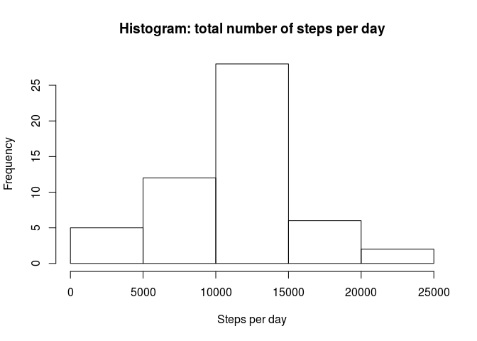
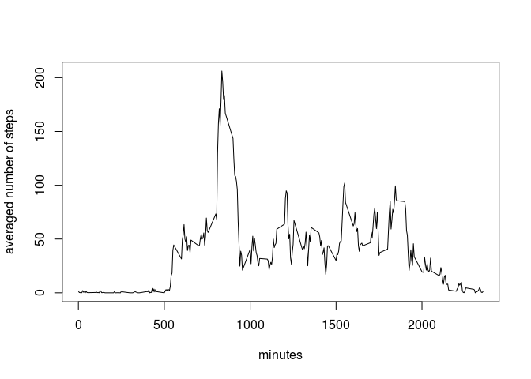
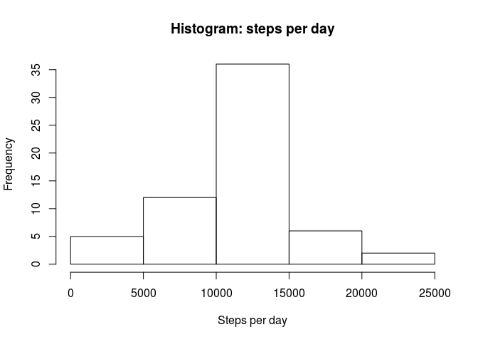
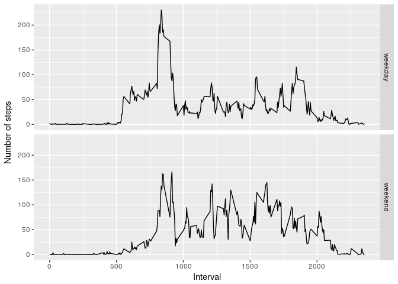

## Loading and preprocessing the data
Set working directory; unzip and load data; convert dates to date class; create data frame without NA values

```r
setwd("/home/tobias/Dokumente/DataScience/repo/RepData_PeerAssessment1/")
unzip("activity.zip")
act <- read.csv("activity.csv")
act$date <- as.Date(strptime(act$date, format="%Y-%m-%d"))
actNA <- act[!is.na(act$steps),]
```

## What is mean and median of the total number of steps taken per day?
Group data using *tapply()*; plot histogram of total number of steps per day; calculate mean and median

```r
stepsPerDay <- with(act, tapply(steps,date,sum))
stepsPerDay <- stepsPerDay[!is.na(stepsPerDay)]
hist(stepsPerDay, xlab="Steps per day", main="Histogram: total number of steps per day")
```

<!-- -->

```r
mean(stepsPerDay)
```

```
## [1] 10766.19
```

```r
median(stepsPerDay)
```

```
## [1] 10765
```

## What is the average daily activity pattern?
Group data using *tapply()*; plot steps per interval averaged over all days; calculate interval with maximal number of steps

```r
stepsPerInt <- with(actNA, tapply(steps,interval,mean))
plot(x=names(stepsPerInt),y=stepsPerInt, type="l",xlab="minutes",ylab="averaged number of steps")
```

<!-- -->

```r
maxInt <- names(which(stepsPerInt==max(stepsPerInt)))
```
The interval with the maximal number of steps averaged over all days is 835 minutes.

## Imputing missing values

```r
sumNA <- sum(is.na(act$steps))
```
The total number of missing values in the dataset is 2304. 

Assign averaged values of steps per interval to corresponding NA values; replot histogram of total number of steps per day with replaced NA values; recalculate mean and median.

```r
days <- length(unique(act$date))
stepsPerIntRep <- rep(stepsPerInt, days)
actNoNA <- act
actNoNA$steps[is.na(act$steps)] <- stepsPerIntRep[is.na(act$steps)]
stepsPerDayNA <- with(actNoNA, tapply(steps,date,sum))
hist(stepsPerDayNA, xlab="Steps per day", main="Histogram: steps per day")
```

<!-- -->

```r
mean(stepsPerDayNA)
```

```
## [1] 10766.19
```

```r
median(stepsPerDayNA)
```

```
## [1] 10766.19
```
The mean is identical to the one calculated in the first part of the assignment as only averaged values where added. The median is now equal to the mean which was not the case in the first assignment.

## Are there differences in activity patterns between weekdays and weekends?
Steps per interval and per "weekday"/"weekend"

```r
library(dplyr, warn.conflicts = FALSE)
actNoNA <- mutate(actNoNA, day=weekdays(actNoNA$date))
actNoNA$day <- ifelse(actNoNA$day %in% c("samedi","dimanche"),"weekend","weekday")
stepsPerIntNA <- with(actNoNA, tapply(steps,list(interval,day),mean))
```
Transform matrix (output of tapply) to conventional data frame

```r
lengthdf <- dim(stepsPerIntNA)[1]*dim(stepsPerIntNA)[2]
df <- data.frame(rep(0,lengthdf),rep(0,lengthdf),rep(0,lengthdf))
idx <- 1
for (i in 1:dim(stepsPerIntNA)[1]) {
        for (j in 1:dim(stepsPerIntNA)[2]) {
                df[idx,1] <- stepsPerIntNA[i,j]
                df[idx,2] <- as.numeric(rownames(stepsPerIntNA)[i])
                df[idx,3] <- colnames(stepsPerIntNA)[j]
                idx <- idx + 1
        }
}
names(df) <- c("steps","interval","day")
```
Plot resulting data frame: comparison of number of steps per interval as a function of day

```r
library(ggplot2)
qplot(x=interval, y=steps, data=df, facets = day~., geom="line", xlab = "Interval", ylab = "Number of steps")
```

<!-- -->

There is a difference in the step pattern as can be seen by comparing the two plots. Possible reasons might be the commute to work and an office job during weekdays.
